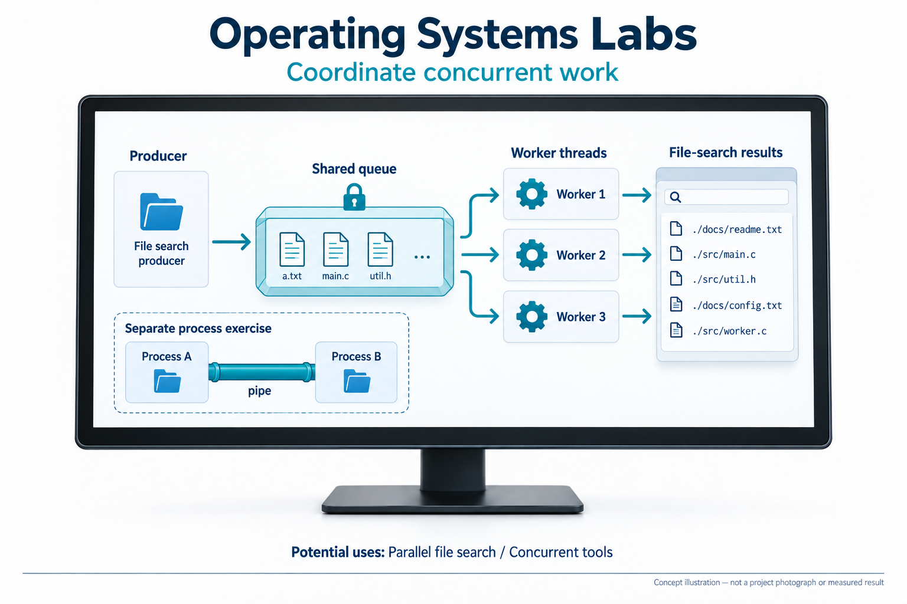
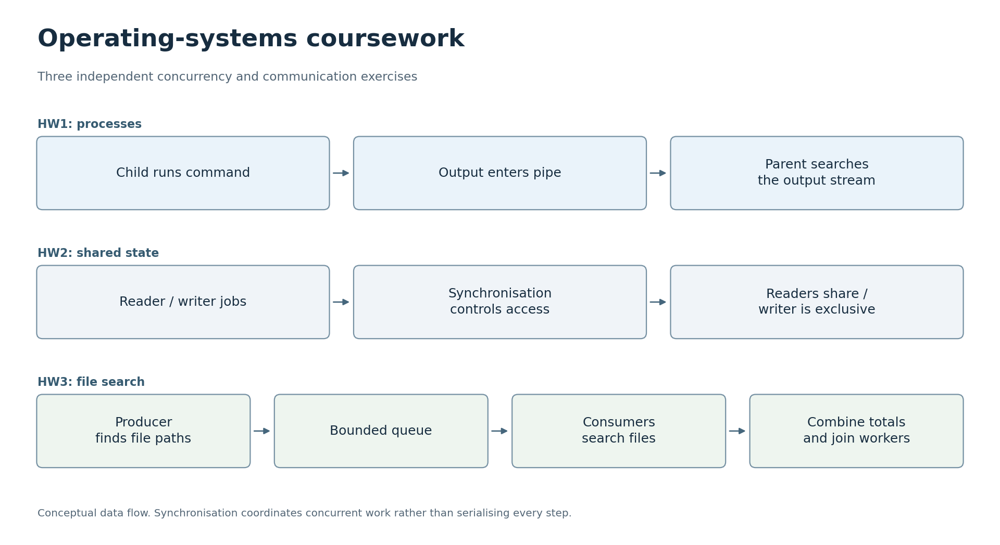

# Operating Systems Labs

This repository contains operating-systems coursework by Sangheon Park in C, along with examples supplied for the course.

In [HW1](HW1/hw1_21800275.c), a program starts another command, receives its output through a pipe and searches that output. The [assignment README](HW1/README.txt) describes the command arguments and the exact and flexible search modes.

[HW2](HW2/rwlock.c) is a reader/writer synchronisation exercise. Its input sequence is stored in [sequence.txt](HW2/sequence.txt).

[HW3](HW3/mtws.c) searches files in a directory with a bounded producer/consumer queue and worker threads. It accepts `-b` for buffer size, `-t` for thread count, `-d` for directory and `-w` for the search word. HW2 and HW3 were updated from the local coursework copy on 28 September 2026.

## Project goal

Learn how processes communicate and how threads coordinate shared data and file-search work.



AI-generated concept illustration. Device appearance, interface layout and example graphics are illustrative, not project photographs or measured results.

## Where it could be used

The producer-consumer and worker patterns are useful starting points for parallel file-search tools and other programs that divide independent jobs among threads. The pipe exercises illustrate how separate processes can pass data to one another. Applying these patterns to a longer-running tool would require checking error handling, cancellation and resource cleanup beyond the individual lab cases.

## At a glance



Each row describes an independent exercise or workflow; the repository is not one connected application. [SVG](docs/flowcharts/os.svg)

## How the three exercises fit together

HW1 is about communication between processes. The child runs the requested command and redirects its standard output into a pipe. The parent reads that stream and finds the requested text. Exact matching and the optional character-based mode are different: the latter looks for any character from the supplied search word, rather than doing approximate word matching.

HW2 is about access to shared state. It reads a sequence of reader and writer jobs, creates threads and coordinates them with semaphores and a reader count. Multiple readers can share access, while a writer needs exclusive access. The printed creation, start and end times help inspect an execution; they do not by themselves prove fairness or freedom from starvation.

HW3 distributes file-search work. One producer recursively discovers files and puts paths into a bounded circular buffer. Consumer threads remove paths and count the search word in each file. Semaphores coordinate empty spaces, queued items, buffer access and shared totals. The producer supplies termination markers and the main thread joins the workers before finishing.

The course examples remain beside the assignments to preserve the original learning context. They are supplied reference material rather than additional student-authored applications.

## Building

The code expects a Linux/POSIX environment with GCC, pthreads and semaphores. The following are suggested build commands; they have not been run in the Windows portfolio environment:

```sh
gcc -Wall -Wextra HW1/hw1_21800275.c -o wspipe
gcc -Wall -Wextra -pthread HW2/rwlock.c -o rwlock
gcc -Wall -Wextra -pthread HW3/mtws.c -o mtws
```

From the repository root in the intended Linux environment, these are small example invocations after compilation:

```sh
./wspipe 'ls -al' README
./rwlock HW2/sequence.txt
./mtws -b 8 -t 2 -d HW1 -w main
```

The first program executes the command passed to it. The third searches the specified directory, so select a small test folder when first examining its output. These are usage examples derived from the source, not freshly verified Linux runs. HW2 compiled with MinGW GCC 14.2 on Windows. A Linux environment was not available, so the full POSIX programs and concurrency behavior remain unverified. The generated binaries in the archive are historical files, not portable builds. No new concurrency stress test or fairness measurement has been performed.

The `Source_Codes_for_Ch*` directories contain teaching examples rather than my original implementations.

[Original repository](https://github.com/oldprize47/2025_OS). Original history and attribution are retained.
