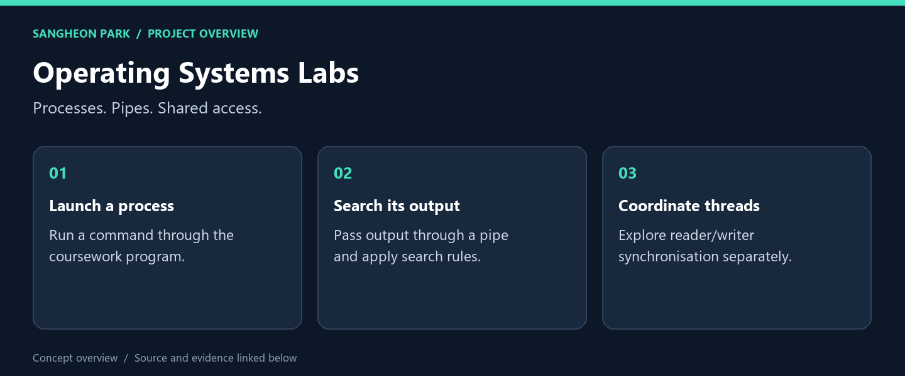
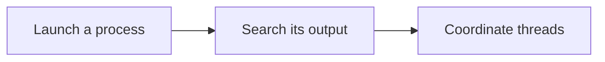

# Operating Systems Labs

**Two systems-programming exercises: searching command output through process/pipe communication, and coordinating readers and writers.**



[What I built](#what-i-built) · [My role](#my-role) · [Code and reproduction](#code-and-reproduction) · [Portfolio](https://github.com/oldprize47-SH)

## What I built

| Deliverable | What it does | Explore |
|---|---|---|
| **Process and pipe exercise** | Command-output search implementation | [Source / result](HW1/hw1_21800275.c) |
| **Usage contract** | Exact and flexible search arguments | [Source / result](HW1/README.txt) |
| **Reader/writer exercise** | Shared-access synchronisation | [Source / result](HW2/rwlock.c) |

### Result at a glance

Source archive inspected. Linux/POSIX build and concurrency behaviour have not been revalidated.

## My role

HW1 and HW2 are the coursework entry points. The Source_Codes_for_Ch* directories are course examples and are not presented as original project implementations.

## How it works



The diagram is a reading route through separate exercises, not one integrated runtime.

## Code and reproduction

## Intended environment

Use Linux or a suitable POSIX environment with GCC, pthreads and semaphores.
Suggested compile commands, **not executed in this Windows portfolio pass**:

```sh
gcc -Wall -Wextra HW1/hw1_21800275.c -o wspipe
gcc -Wall -Wextra -pthread HW2/rwlock.c -o rwlock
```

The original HW1 README explains the command/search arguments. Inspect a command
before passing it to the process exercise. The archive's generated binaries are
historical artefacts, not portable executables or current test evidence.

No fresh POSIX build, concurrency stress test or fairness claim is made here.

## Source and credits

[Original repository](https://github.com/oldprize47/2025_OS) · [Portfolio home](https://github.com/oldprize47-SH)

Course scaffolding, team contributions and third-party assets retain their original attribution. This documentation does not grant a new licence.
