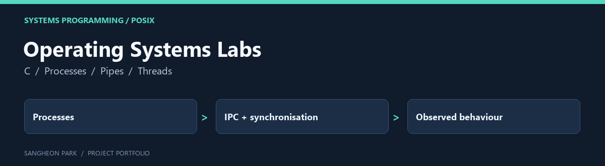

# Operating Systems Labs



POSIX-oriented coursework on processes, pipes and thread synchronisation, with a command-output search program and a reader/writer-lock exercise.

[Portfolio home](https://github.com/oldprize47-SH) · [Original repository](https://github.com/oldprize47/2025_OS)

## Contribution and context

HW1 and HW2 are the coursework entry points. The Source_Codes_for_Ch* directories are course examples and are not presented as original project implementations.

## Code map

| Entry | Purpose |
|---|---|
| [HW1/hw1_21800275.c](HW1/hw1_21800275.c) | Process/pipe command-output search |
| [HW1/README.txt](HW1/README.txt) | Exact and flexible search behaviour |
| [HW2/rwlock.c](HW2/rwlock.c) | Reader/writer synchronisation exercise |
| [HW2/sequence.txt](HW2/sequence.txt) | Recorded exercise input |
| [Source_Codes_for_Ch4](Source_Codes_for_Ch4) | Thread examples supplied for study |

## Intended environment

Use Linux or a suitable POSIX environment with GCC, pthreads and semaphores.
Suggested compile commands, **not executed in this Windows portfolio pass**:

```sh
gcc -Wall -Wextra HW1/hw1_21800275.c -o wspipe
gcc -Wall -Wextra -pthread HW2/rwlock.c -o rwlock
```

The original HW1 README explains the command/search arguments. Inspect a command
before passing it to the process exercise. The archive's generated binaries are
historical artefacts, not portable executables or current test evidence.

No fresh POSIX build, concurrency stress test or fairness claim is made here.

## Archive policy

The fork retains upstream history, source attributions and course material. The
portfolio documentation does not assign a new licence or claim sole authorship
of inherited code. Current checks are stated above; an untested component is not
presented as verified.
